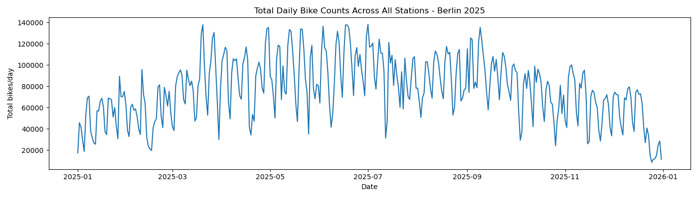

# Berlin Mobility Pipeline


Ein Data-Engineering-Portfolio-Projekt, das eine lokale ETL-Pipeline für Berliner Fahrradzähldaten aufbaut.

Die Pipeline lädt Rohdaten aus dem Berliner Open-Data-Portal aus einer Excel-Datei, bereinigt und transformiert die Daten, validiert den verarbeiteten Datensatz und speichert saubere CSV-, Parquet- und SQLite-Outputs, die für Analysen, lokale Abfragen oder spätere Cloud-Speicherung vorbereitet sind.

## Projektziel

Dieses Projekt zeigt zentrale Fähigkeiten im Bereich Data Engineering:

- Explorative Datenanalyse
- ETL-Pipeline-Design
- Datenbereinigung und Datenumformung
- Konfigurationsgesteuerte Pipeline-Ausführung
- Logging
- Datenvalidierung
- Speicherung als CSV, Parquet und SQLite
- Unit Testing
- Ruff Linting
- GitHub Actions / CI
- Git/GitHub-Projektorganisation

Das Projekt ist Teil eines größeren Portfolios mit Fokus auf Data Engineering und Cloud Workflows.

## Datensatz

Das Projekt verwendet Fahrradzähldaten aus dem Berliner Open-Data-Portal.

In dieser Version verarbeitet die Pipeline das Tabellenblatt:

```text
Jahresdatei 2025
```

Die Rohdatei wird lokal an folgendem Pfad erwartet:

```text
data/raw/bike_counts.xlsx
```

Der Ordner `data/` wird von Git ignoriert und muss lokal erstellt werden.

## Projektstruktur

```text
berlin-mobility-pipeline/
├── config/
│   └── config.yaml
├── notebooks/
│   └── eda_bike_counters.ipynb
├── src/
│   ├── __init__.py
│   ├── ingest.py
│   ├── transform.py
│   ├── validate.py
│   ├── load.py
│   └── main.py
├── tests/
│   ├── test_transform.py
│   ├── test_validate.py
│   └── test_load.py
├── .github/
│   └── workflows/
│       └── tests.yml
├── pyproject.toml
├── requirements.txt
└── README.md
```

## ETL-Pipeline

Die Pipeline folgt einer klassischen ETL-Struktur:

```text
Rohdaten aus Excel
      ↓
Ingest
      ↓
Transform
      ↓
Validate
      ↓
Load
      ↓
Verarbeitete CSV-, Parquet- und SQLite-Outputs
```

## Architekturüberblick

```text
Berliner Open-Data-Excel-Datei
        ↓
Ingest
- Konfiguration laden
- Rohdatei prüfen
        ↓
Transform
- Zeitstempel bereinigen
- Stations-IDs bereinigen
- Wide Format in Long Format umwandeln
        ↓
Validate
- Pflichtspalten prüfen
- fehlende Werte prüfen
- Wertebereiche prüfen
        ↓
Load
- CSV für einfache Lesbarkeit speichern
- Parquet für analytische Workloads speichern
- SQLite für lokale SQL-Abfragen speichern
        ↓
GitHub Actions
- Ruff Linting
- Pytest Unit Tests
```

## Designentscheidungen

- Die Rohdaten werden nicht in Git versioniert, da Datendateien lokal oder später über Cloud Storage verwaltet werden sollten.
- Die Pipeline ist konfigurationsgesteuert, damit Dateipfade und Parameter nicht hart im Python-Code kodiert sind.
- Die Transformationslogik liegt in `src/transform.py`, während das Notebook nur für explorative Analyse verwendet wird.
- Die Daten werden als CSV, Parquet und SQLite gespeichert: CSV ist leicht lesbar, Parquet ist effizienter für analytische Workloads und SQLite ermöglicht lokale SQL-Abfragen.
- Die Validierung erfolgt vor dem Speichern, damit fehlerhafte Daten nicht unbemerkt in den Output gelangen.
- GitHub Actions führt bei jedem Push automatisch Ruff Linting und Unit Tests aus.
- Die aktuelle Version bleibt lokal und kostenfrei; Cloud Storage ist als mögliche spätere Erweiterung vorgesehen.

### Ingest

`src/ingest.py` prüft, ob die Rohdatei existiert, und lädt die Pipeline-Konfiguration.

### Transform

`src/transform.py` enthält die zentrale Transformationslogik:

- Lädt das Tabellenblatt für 2025
- Benennt die Zeitspalte in `timestamp` um
- Wandelt Zeitwerte in ein Datetime-Format um
- Bereinigt Stations-IDs aus unübersichtlichen Excel-Headern
- Wandelt Fahrradzählwerte in numerische Werte um
- Transformiert die Daten vom Wide Format ins Long Format
- Ergänzt nützliche Zeitmerkmale wie `date`, `hour`, `weekday` und `month`

### Validate

`src/validate.py` prüft den verarbeiteten Datensatz, bevor er gespeichert wird.

Die Validierung prüft unter anderem:

- Der verarbeitete Datensatz ist nicht leer
- Alle erforderlichen Spalten sind vorhanden
- `timestamp` enthält keine fehlenden Werte
- `station_id` enthält keine fehlenden Werte
- `bike_count` enthält keine negativen Werte
- `hour` liegt zwischen 0 und 23
- `month` liegt zwischen 1 und 12

### Load

`src/load.py` speichert den verarbeiteten Datensatz als CSV-Datei, Parquet-Datei und lokale SQLite-Datenbank.

Der aktuelle Output ist:

```text
data/processed/bike_counts_2025_clean.csv
data/processed/bike_counts_2025_clean.parquet
data/processed/berlin_mobility.db
```

## Konfiguration

Die Pipeline-Einstellungen werden in folgender Datei gespeichert:

```text
config/config.yaml
```

Beispiel:

```yaml
dataset:
  raw_file_path: "data/raw/bike_counts.xlsx"
  sheet_name: "Jahresdatei 2025"

output:
  processed_csv_path: "data/processed/bike_counts_2025_clean.csv"
  processed_parquet_path: "data/processed/bike_counts_2025_clean.parquet"

database:
  sqlite_path: "data/processed/berlin_mobility.db"
  table_name: "bike_counts_2025"

logging:
  level: "INFO"
```

## Lokale Ausführung

Repository klonen:

```bash
git clone https://github.com/muhannadnajjar1-hash/berlin-mobility-pipeline.git
cd berlin-mobility-pipeline
```

Abhängigkeiten installieren:

```bash
pip install -r requirements.txt
```

Lokale Datenordner erstellen:

```bash
mkdir -p data/raw data/processed
```

Die Excel-Rohdatei hier ablegen:

```text
data/raw/bike_counts.xlsx
```

ETL-Pipeline ausführen:

```bash
python src/main.py
```

Erwarteter Output:

```text
data/processed/bike_counts_2025_clean.csv
data/processed/bike_counts_2025_clean.parquet
data/processed/berlin_mobility.db
```

SQLite-Datenbank optional prüfen:

```bash
sqlite3 data/processed/berlin_mobility.db
```

Beispielabfrage:

```sql
SELECT COUNT(*) FROM bike_counts_2025;
```

## Tests und Linting lokal ausführen

Unit Tests lokal ausführen:

```bash
pytest
```

Ruff Linting lokal ausführen:

```bash
ruff check src tests
```

Die Tests prüfen unter anderem:

- Stations-IDs werden korrekt bereinigt
- Ungültige Zeitstempel werden entfernt
- Daten werden korrekt vom Wide Format ins Long Format transformiert
- Die Validierung akzeptiert gültige verarbeitete Daten
- Die Validierung schlägt bei ungültigen Daten fehl
- Der SQLite-Export erstellt eine abfragbare Tabelle

## Continuous Integration

Dieses Projekt verwendet GitHub Actions, um Ruff Linting und Unit Tests automatisch bei jedem Push und Pull Request auf den `main`-Branch auszuführen.

Der Workflow ist definiert in:

```text
.github/workflows/tests.yml
```

Der Workflow installiert die Projektabhängigkeiten und führt folgende Befehle aus:

```bash
ruff check src tests
pytest
```

## Aktuelle Ergebnisse

Der Datensatz für 2025 enthält:

```text
8.760 stündliche Datensätze
35 Fahrradzählstationen
306.600 Zeilen nach der Transformation ins Long Format
```

Der verarbeitete Output enthält folgende Spalten:

```text
timestamp, station_id, bike_count, date, hour, weekday, month
```

## Visualisierung

Die folgende Grafik zeigt die täglichen Fahrrad-Zählwerte über alle Stationen im Jahr 2025.



